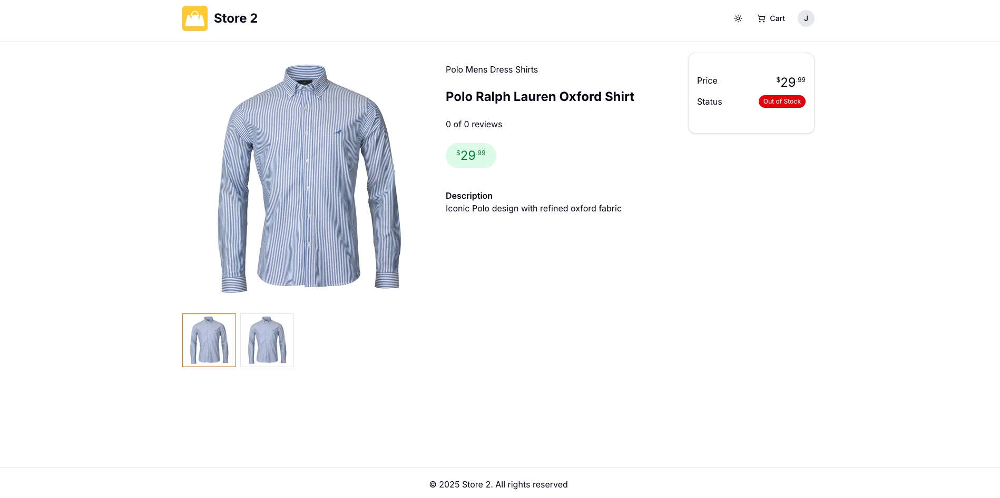
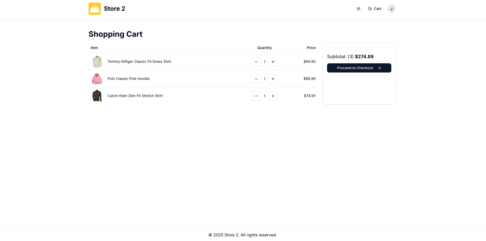
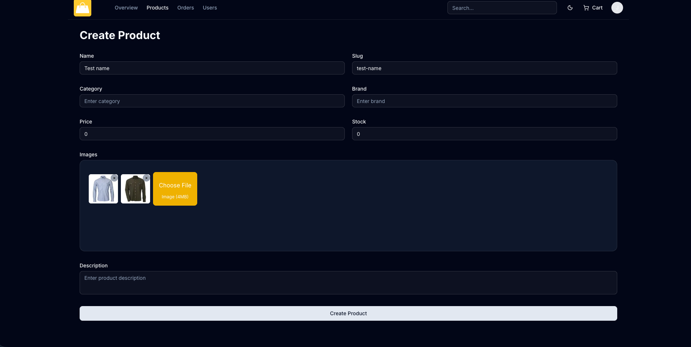
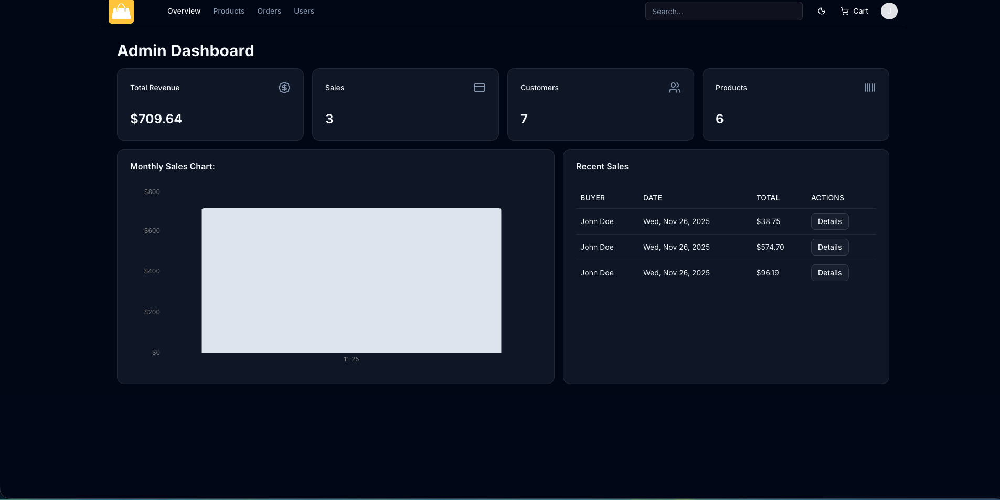

# E-Commerce Website (Next.js) — Project Documentation
A full featured Ecommerce website built with Next.js, TypeScript, PostgreSQL and Prisma.

## Overview
This project is a more modern and scalable evolution of my earlier MERN-based e‑commerce project (**proshop-demo**). Unlike the MERN version—which relies on a traditional separation of backend (Express) and frontend (React)—this implementation takes full advantage of **Next.js**, offering:

- **Server-side rendering (SSR) and static generation**, resulting in faster loading and better SEO.
- **Built‑in API routes**, removing the need for a separate Express server.
- **Improved performance** through React Server Components and the App Router.
- **Cleaner architecture**, with unified routing, layouts, and component organization.
- **Simpler deployment**, since frontend and backend live in the same Next.js codebase.

This creates a faster, more maintainable, and more production‑ready foundation compared to the older MERN version.
- **Database improvements**, including the use of Prisma with PostgreSQL, offering a more structured ORM and easier, safer queries compared to the previous MERN stack.

### Implemented Improvements (confirmed)
- Removed manual generate button; slug names are generated automatically.
- Admin now can delete uploaded pictures before submitting if a wrong file was chosen.

---

## Screenshots
- 
- 
- 
- 
- 

## Key Features

### **1. Next.js App Router Architecture**
- Uses the new **App Router**.
- Clear separation between server and client components.
- Built-in routing, layouts, and API routes.

### **2. Modern UI/UX**
- Styled with **Tailwind CSS**.
- Fully responsive design.
- Reusable components such as Navbar, Product Cards, and Layout wrappers.
- Supports dark, light, and system theme modes, automatically adapting to the user's system preference and allowing manual toggle between dark and light themes.

### **3. Product Management**
- Dynamic product pages.
- Optimized image handling.
- Expandable structure for future admin CRUD.

### **4. Shopping Cart System**
- Add/remove products.
- Update quantities.
- Persistent cart state.

### **5. User Authentication**
- Secure login and registration.(Next Auth)
- Protected routes.

### **6. Payments**
- Integrated **PayPal** for online payments.
- Integrated **Stripe** for online payments.
- Complete checkout flow implemented.

### **7. Admin Dashboard**
- Admin page for managing users and products.
- Product management.
- Orders overview.
- Admin area with stats & chart using Recharts

---

## Technologies Used
- **Next.js 14+** (App Router)
- **React**
- **Tailwind CSS**
- **Prisma / PostgreSQL**
- **NextAuth**

---

## Roadmap
- [ ] Checkout + Stripe
- [ ] Admin dashboard
- [ ] Product categories & filters
- [ ] Reviews system
- [ ] Animations & transitions
- [ ] Performance & caching improvements

---

## Credits
This project was initially inspired by Brad Traversy's Next.js e‑commerce tutorial.  “All further development and enhancements are my own”

---

## Repository
GitHub: `karmartir/e-commerce-website-next.js`
